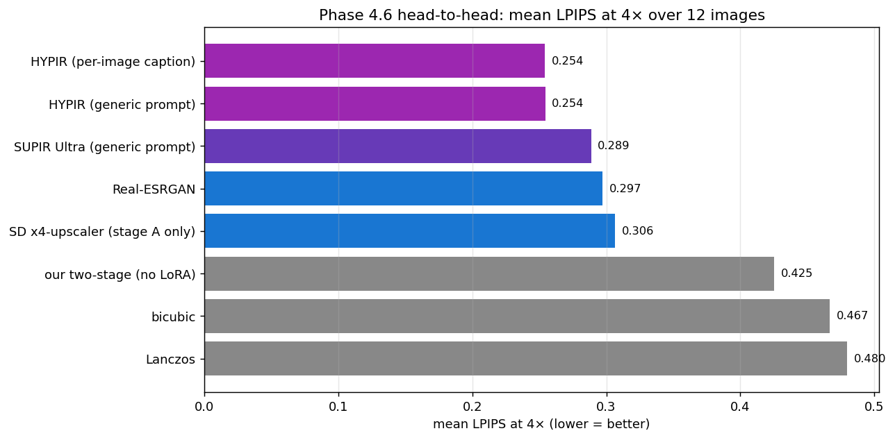
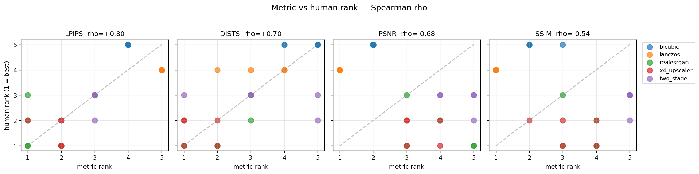
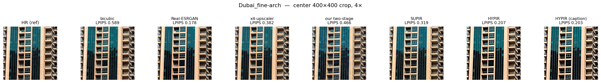
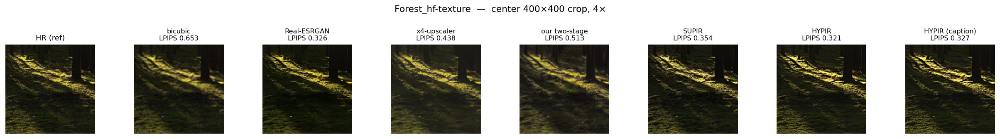
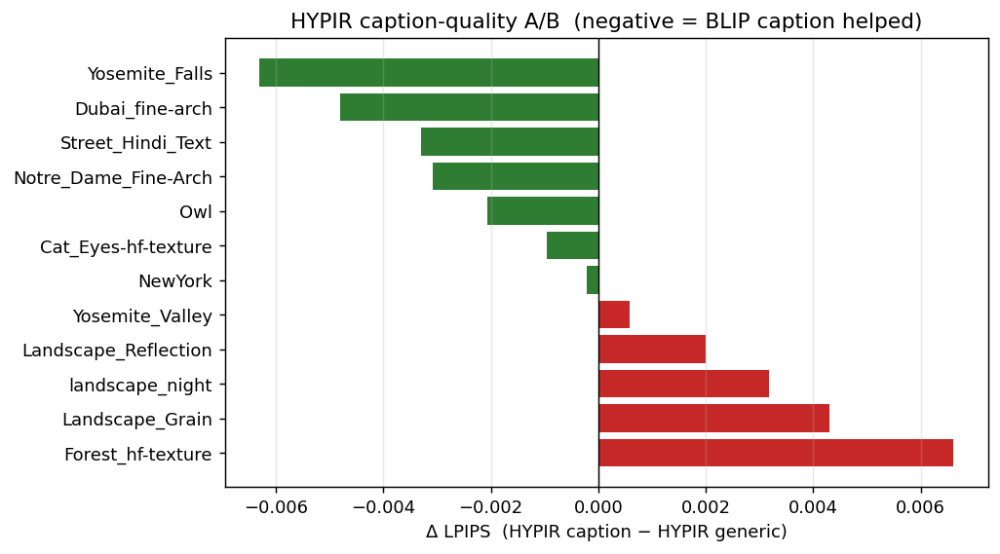
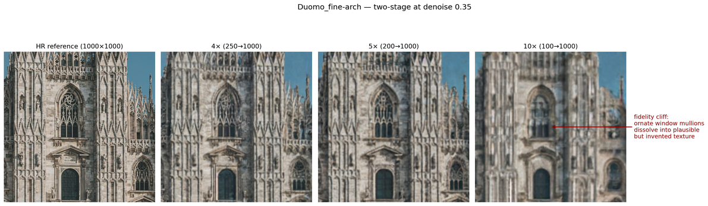
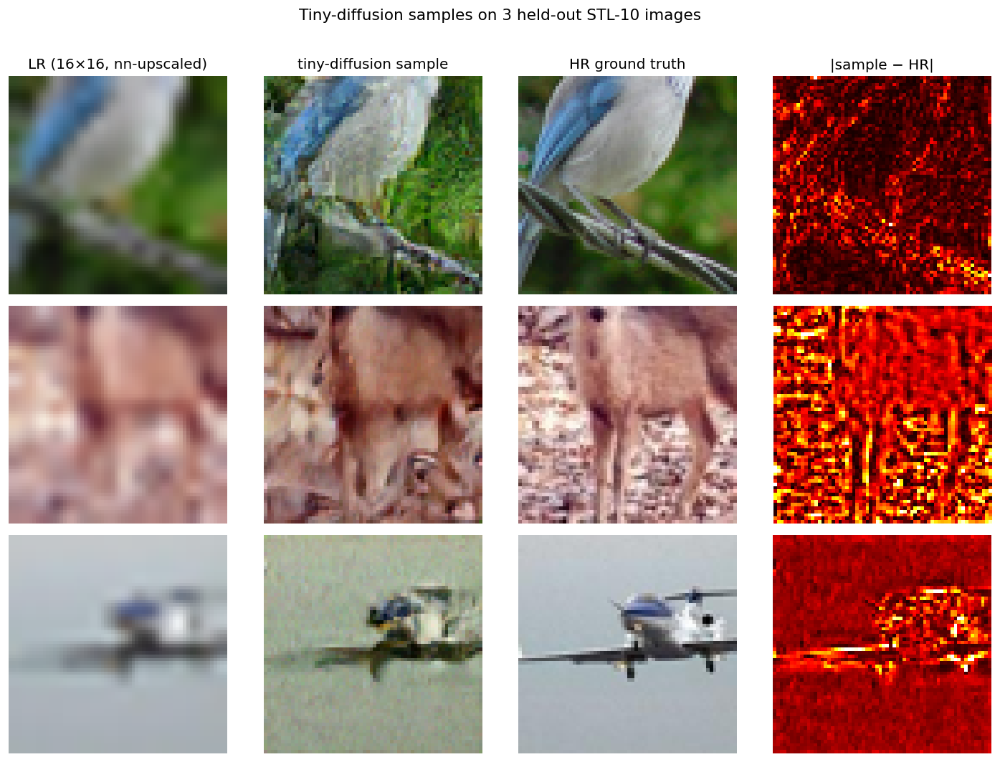

# SD_image_upscaler

> *A diffusion image upscaler in 50 hours: how far can one person get against SUPIR and HYPIR on consumer hardware?*

A capability study, not a product. Trains and benchmarks a diffusion-based super-resolution pipeline against the 2024 research SOTA (SUPIR), its commercial successor (HYPIR), and a strong non-diffusion baseline (Real-ESRGAN). Built on a single laptop GPU + ~$8 of cloud spend, with the entire training + evaluation pipeline reproducible from `git clone`.

The honest one-line summary: **at 4× super-resolution where everyone competes, our pipeline lands behind SOTA but the gap is narrower than reputation suggests, and our negative results catalogue what *not* to do when scaling diffusion-SR on a small budget.**

---

## What is SUPIR (and HYPIR)?

**[SUPIR (Yu et al., CVPR 2024)](https://arxiv.org/abs/2401.13627)** — *Scaling Up to Excellence: Practicing Model Scaling for Photo-Realistic Image Restoration in the Wild* — is the reference SOTA for diffusion-based super-resolution. Built on SDXL, it adds a ~600M-parameter restoration adapter (ZeroSFT-style, zero-initialised), uses LLaVA-generated captions for rich text conditioning, and is trained on LSDIR + curated wild-image data on research-cluster compute. The paper specifically argues that quality emerges from *scale* — bigger model, bigger data, richer prompts.

**HYPIR** is SUPIR's commercial descendant offered via [suppixel.ai](https://suppixel.ai). Same conceptual architecture, productised. Available as a paid web service that accepts a low-res image plus a description and returns an upscale at up to 4×.

This project is framed against both — at 4× where the comparison is fair (everyone is 4× native), and explicitly *not* at 5× / 10× where no public diffusion-SR tool currently operates.

## What this project is

A **50-hour consumer-GPU exploration** using the same conceptual recipe as SUPIR — diffusion + LR conditioning + captions + adapter training — at small scale.

- **One laptop GPU** (RTX 5070 Laptop, 8 GB VRAM, Blackwell sm_120) for development.
- **One cloud GPU** (RunPod RTX 5090 32 GB at $0.69/hr) for the four LoRA training attempts. Total cloud spend: $3.40.
- **One commercial-API account** (suppixel.ai $5/month) for the head-to-head SUPIR + HYPIR runs.
- **2,600 source images** (DIV2K + filtered Unsplash Lite) → **~7,800 (LR_128, HR_512) training pairs**, vs SUPIR's ~86,000 LSDIR images.
- **Captions via BLIP-large**, vs SUPIR's LLaVA — a deliberate scale-down that itself becomes a finding.

The README is the project's narrative artifact. Every claim below is reproducible from the linked notebook or script in this repo.

## Pipeline architecture

```
LR input  (200×200 = 5×, or 250×250 = 4×, or 100×100 = 10× stretch)
    │
    ▼
[stage A]  stable-diffusion-x4-upscaler  (HuggingFace pretrained)
           4-channel latent + 3-channel LR pixel concat (UNet input is 7ch)
           noise-level conditioning via class_labels (0..350)
    │
    ▼
intermediate  (4× of LR: 800/1000/400 depending on input ratio)
    │
    ▼
[stage B]  bicubic-fit to target_size (1000×1000)
           + ControlNet Tile (lllyasviel/control_v11f1e_sd15_tile)
           + SD 1.5 img2img with denoise=0.30
           + tiled at 512×512 with 128px overlap, linear-ramp blend
           [+ optional LoRA on stage-B SD 1.5 cross-attention]
    │
    ▼
output  (1000×1000)
```

Stage A handles the native 4× lift with a model purpose-built for it. Stage B was *intended* to refine and add domain-specific texture via ControlNet Tile + (optionally) a trained LoRA. The LoRA story didn't go where we expected — see Findings.

## Key architectural choices (and where SUPIR diverges)

| Concern | This project | SUPIR |
|---|---|---|
| Base diffusion model | x4-upscaler (4× native) + SD 1.5 (refinement) | SDXL (refinement only) |
| Adapter type | LoRA on cross-attention (q/k/v/out_proj) | Zero-init additive (ZeroSFT) on ResBlock features |
| Adapter scale at init | scale 1.0 (multiplicative from step 0) | exactly 0 (training ramps up) |
| Caption model | BLIP-large | LLaVA |
| Training images | ~2,600 sources → ~7,800 crop pairs | ~86,000 (LSDIR) |
| Training compute | $3.40 (4 RunPod 5090 runs) | research-cluster scale |
| Max upscale ratio | targets 4× / 5× / 10× | 4× native |

The single most important divergence, in retrospect, is **adapter type**. SUPIR's zero-init choice means the trained base model behaves identically at step 0 of training — only later training pushes the adapter weights, and only as much as the loss demands. Our LoRA on attention modifies the base model's behaviour from step 1, and the x4-upscaler's denoising trajectory turns out to be far more fragile than SD 1.5 t2i's. Three failed training attempts confirmed this.

## Findings & leaderboard

### Headline numbers (full 60-image test set, mean LPIPS — lower = better)

| Method | 4× (250→1000) | 5× (200→1000) | 10× (100→1000) |
|---|---:|---:|---:|
| **Real-ESRGAN** | **0.254** | **0.299** | **0.475** |
| SD x4-upscaler (stage A only) | 0.290 | 0.334 | 0.543 |
| our two-stage (no LoRA) | 0.416 | 0.433 | 0.592 |
| our stage-B + LoRA | — | 0.443 | — |
| bicubic | 0.441 | 0.517 | 0.692 |
| Lanczos | 0.452 | 0.531 | 0.697 |

### 12-image SUPIR / HYPIR head-to-head at 4× (mean LPIPS)

| Method | mean LPIPS | vs Real-ESRGAN on this subset |
|---|---:|---|
| HYPIR + per-image caption | **0.254** | wins |
| HYPIR generic prompt | 0.254 | wins |
| SUPIR Ultra | 0.289 | wins |
| Real-ESRGAN | 0.297 | (baseline) |
| SD x4-upscaler | 0.306 | loses by 3% |
| our two-stage | 0.425 | loses by 43% |



### Five findings worth surfacing

**1. The SOTA gap to Real-ESRGAN at 4× is small.** SUPIR beats Real-ESRGAN by ~3% LPIPS on our 12-image subset. HYPIR edges out SUPIR by another ~12%. The big gap is *into* the bicubic/Lanczos cluster, not within the "real SR methods" tier. Worth knowing for anyone choosing an SR tool — for clean LR inputs, Real-ESRGAN is competitive at a fraction of the operational cost.

**2. Our base model is competitive; what we built on top regressed it.** The x4-upscaler alone scores within 6% of SUPIR at 4×. Stack ControlNet Tile + img2img refinement on top (our two-stage pipeline) and it regresses 39%. The diffusion-refinement-of-an-already-good-upscaler pattern overshoots when LR is clean bicubic — there's nothing for diffusion to invent that the dedicated SR pipeline didn't already extract.

**3. LoRA on x4-upscaler is the wrong tool.** Three training attempts at varying recipes (rank, alpha, lr, degraded vs bicubic LR) all produced *destructive* deltas — output LPIPS 0.78–0.92 vs base 0.33. The denoising trajectory is unusually fragile to attention-layer perturbations. SUPIR's zero-init additive adapter on ResBlock features (not cross-attention) avoids exactly this failure mode by construction.

**4. Stage-B SD 1.5 LoRA works (doesn't crash) but doesn't help.** The pivot to standard SD 1.5 LoRA produced stable, prompt-aligned outputs but **3.3% win rate vs Real-ESRGAN** at 5× — neutral-to-slightly-negative on average, with one narrow positive niche: night scenes (62.5% win rate, mean Δ −0.006 LPIPS). Published as a research artifact at [`bradhinkel/sd-image-upscaler-sd15-lora`](https://huggingface.co/bradhinkel/sd-image-upscaler-sd15-lora) with an honest model card.

**5. PSNR and SSIM ANTI-correlate with human judgment for diffusion-SR.** Spearman ρ vs human ranks (n=25 method-image pairs over 5 images at 5×):
   - LPIPS: ρ = **+0.80** (strong positive)
   - DISTS: ρ = +0.70
   - PSNR: ρ = **−0.68**
   - SSIM: ρ = **−0.54**

   

   Pixel-matching metrics actively reward the conservative bicubic outputs over the invented-but-plausible detail humans prefer. **If you're benchmarking diffusion-SR with PSNR/SSIM, you're measuring the wrong thing.** This is a methodological finding independent of how good our model is.

## Gallery

### Phase 4.6 head-to-head — Dubai fine architecture (our hardest loss case)



Densely-repeating ornate facades expose the difference between extracting structure (Real-ESRGAN, SUPIR, HYPIR — clean) and inventing it (our two-stage — visibly unstable).

### Phase 4.6 head-to-head — Forest hf_texture (canonical SUPIR test case)



High-frequency natural texture is exactly what SUPIR's reputation is built on. The visual gap is where you'd expect; the LPIPS gap (HYPIR 0.18 vs Real-ESRGAN 0.21 vs our two-stage 0.42) confirms it.

### Caption A/B on HYPIR — the null result



Per-image BLIP-large captions vs the generic prompt `"a high-resolution photograph, sharp detail, professional quality"`: mean Δ ~0 LPIPS across 12 images. The "rich captions matter" intuition didn't survive contact with the data on HYPIR specifically. Possible reasons: HYPIR is less prompt-sensitive than SUPIR (which uses LLaVA captions deeply in its restoration encoder), or BLIP-large captions aren't *rich enough* to differentiate vs generic.

### The 5×→10× fidelity cliff (Phase 2)



At 5× (200→1000) ornate window mullions hold up; at 10× (100→1000) they dissolve into plausible-but-invented texture. SUPIR/HYPIR don't help here — neither tool supports >4×. **5× and 10× are research territory beyond what current public diffusion-SR offers.**

### Tiny diffusion from scratch (Phase 3.5)



A pure-PyTorch DDPM walk-through trained in 8 minutes on STL-10. Recognisable but bad — that's the point. Notebook `035_tiny_diffusion.ipynb` has the full implementation next to markdown explaining every line, including 9 pedagogical sections covering the forward process, noise schedule, U-Net architecture, MSE-on-noise objective, and DDIM reverse sampling.

## Cost & compute comparison

| | This project | SUPIR (paper) | HYPIR (suppixel.ai) |
|---|---|---|---|
| Hardware | 1× RTX 5070 (laptop, 8 GB) + 1× RTX 5090 (RunPod, 32 GB) | undisclosed research cluster | hosted service |
| Cloud spend | **$3.40** (4 LoRA runs) + $5/mo suppixel.ai | research grant compute | per-credit usage |
| Training data | 2,600 sources → 7,786 pairs | ~86,000 LSDIR + curated wild | proprietary |
| Captions | BLIP-large (auto, ~$0) | LLaVA (manual prompt engineering) | proprietary |
| Inference rig | 1 RTX 5070 (local) | undisclosed | hosted |
| Public artifacts | full repo + dataset card + LoRA on HF Hub | model + paper | API only |

The cost gap to SUPIR is several orders of magnitude. The cost gap to HYPIR is the difference between writing your own pipeline ($3.40 cloud + a long weekend) and paying $5/month for someone else's. If the goal is shipping good upscales, HYPIR wins on every axis except control. If the goal is *understanding* what's happening, the cheap-and-slow path is more educational.

## Hour log

Approximate, based on commit timestamps and complexity. Engineering hours only — Brad's manual work (test-set curation, suppixel runs, human ranking) excluded.

| Phase | What | Approx hours |
|---|---|---|
| 0 | Repo scaffold, CI, smoke notebook | 2 |
| 1 | Test-set migration, baseline pipeline, contact sheets | 5 |
| 2 | Two-stage with tiling, byte-for-byte tests | 7 |
| 2.5 | VAE swap experiment | 2 |
| 3 | Eval metrics, benchmark, leaderboard, charts | 4 |
| 3.5 | Tiny diffusion from scratch + bug-fix iteration | 4 |
| 4a | Dataset (filter Unsplash, build pairs, BLIP captions, dedup) | 6 |
| 4b | Local rehearsal | 2 |
| 4c | **4 cloud training runs + diagnostics + stage-B pivot** | **12** |
| 4.6 | Subset selection, scoring, head-to-head notebook | 2 |
| 7 | This writeup + final leaderboard + follow-on plan | 3 |
| **Total engineering** | | **~49 hours** |

Cut from scope: Phase 4d (skipped after gate failure), Phase 4.5 (prompt ladder), Phase 5 (Gradio frontend), Phase 6 (Modal + DO deployment). Reasons: the LoRA gate failure made the SDXL run a likely-compounding mistake; with no production-quality LoRA to deploy, the frontend and Modal-deployment phases became a "ship a worse-than-Real-ESRGAN service" exercise that didn't seem worth the remaining hours. They sit in the follow-on roadmap.

## What surprised me / what I'd do differently

**1. The metric story.** Going in I expected LPIPS to be the strict-best metric. The Phase 3 human-correlation experiment showed it's not just *best* — it's the *only* metric of the four that correlates positively with human judgment. PSNR and SSIM actively anti-correlate. I'd run that experiment in Phase 1 next time and never report PSNR/SSIM at all for diffusion-SR work. Lesson: always validate your metrics before trusting them on a new method class.

**2. The base-model trap.** I assumed x4-upscaler would be a forgiving LoRA target since it's "just SD 1.5 with extra channels." It isn't. Specialised models that bake task-specific conditioning into their architecture are *more* fragile to fine-tuning, not less. I'd default to LoRA-on-SD-1.5 in any future diffusion-SR project and only consider the specialised base after rehearsing on the general one.

**3. "Loss decreases" is a trap.** Phase 4b's rehearsal showed a 65% loss reduction; the resulting LoRA produced LPIPS 0.92 (catastrophic). Loss decreased because the LoRA fit a *broken* objective — class_labels conditioning without the corresponding LR noise that the inference path expects. The rehearsal validated the wrong thing. Lesson: always include an end-to-end inference sample in the rehearsal acceptance criteria, not just loss curves.

**4. Negative results have a form.** The four LoRA training attempts (3 x4-upscaler + 1 stage-B SD 1.5) cost $3.40 cloud and ~12 engineering hours. They produced one published model card with honest "does not improve the pipeline" framing, three diagnostic explorations into adapter mechanics, and a clear architectural recommendation (zero-init, ResBlock targets, SDXL base) for the follow-on. That's a lot of project value from "things that didn't work." The instinct to throw more compute when results are bad is usually wrong; the instinct to *understand* what's bad is usually right.

**5. The 4× cap is a finding.** I expected SUPIR/HYPIR to dominate at all three ratios; suppixel.ai's 4× cap meant we couldn't even compare at 5×/10×. That changed the framing from "where we lose" to "where current public tools don't reach." Our 5×/10× experiments became real exploration territory rather than embarrassing comparisons. Lesson: scope-checking your benchmarks early matters as much as scope-checking your model.

## Reproducing this project

### Quick eval (bicubic / Lanczos / Real-ESRGAN / x4-upscaler / two-stage at 4×)

```bash
git clone https://github.com/bradhinkel/SD_image_upscaler.git
cd SD_image_upscaler
uv venv && source .venv/bin/activate
uv pip install -e ".[dev]"

# Migrate the test set (1024×1024 originals → 1000×1000 + LR variants)
python -m scripts.migrate_test_images

# Render every method × every ratio (~25 minutes on a Blackwell laptop GPU)
jupyter execute notebooks/01_baseline.ipynb
jupyter execute notebooks/02_two_stage.ipynb

# Score
python -m scripts.benchmark_pipeline
jupyter execute notebooks/03_eval.ipynb
```

### Stage-B LoRA training (the path that produced a working LoRA)

```bash
# Pull the dataset (private HF repo, requires HF_TOKEN with read access to bradhinkel/...)
hf download bradhinkel/sd-image-upscaler-pairs --repo-type dataset --local-dir data/
tar -xf data/pairs.tar -C data/

# Local 50-step smoke (~3 min)
python -m upscaler.lora_train_sd15_stage_b --config /tmp/smoke.yaml

# Full 8000-step run (~63 min on RTX 5090, ~$0.71)
python -m upscaler.lora_train_sd15_stage_b --config configs/sd15_stage_b.yaml

# Eval through the full Phase 2 two-stage pipeline (~24 min on a 5070)
python -m scripts.eval_lora_stage_b
```

### Phase 4.6 head-to-head reproduction

The 12-image subset and the SUPIR / HYPIR rendering parameters are documented at [`outputs/supir/subset.json`](outputs/supir/subset.json). Renders need a paid suppixel.ai account ($5/month for 100 credits, 24 used). Output naming is `outputs/{supir,hypir}/{stem}_4x.{jpg|png}`. Score with:

```bash
python -m scripts.score_supir_hypir
jupyter execute notebooks/06_supir_head_to_head.ipynb
```

## Follow-on project

What would actually close the SUPIR gap, at three tiers of ambition: see [`docs/follow_on_project.md`](docs/follow_on_project.md). TL;DR — Tier 1 is "swap LoRA for ZeroSFT-style additive adapter on stage-B ResBlocks" (~15 hrs, ~$10 cloud); Tier 3 is the full SUPIR-style rebuild on SDXL with LSDIR-scale data (~200 hrs, ~$300 cloud).

## License

MIT for the code. LoRA weights at `bradhinkel/sd-image-upscaler-sd15-lora` inherit OpenRAIL from SD 1.5 base. Training data attribution: DIV2K (research-only license), Unsplash Lite (ML training permitted under the Lite Dataset terms).
